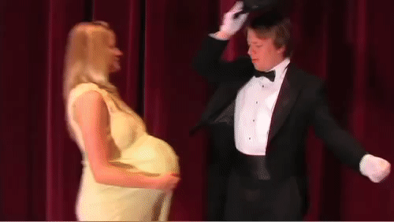
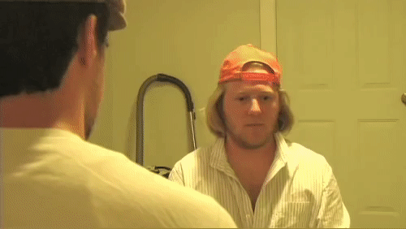
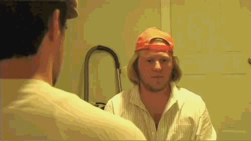

# Video Steganography

[](https://travis-ci.com/Amritaryal44/Video-Steganography)

Hide Your secret videos inside any other videos.
### Example
| Cover video where secret video is to be hidden | Secret Video to be hidden |
|:--:|:--:| 
|  |  |

| cover video with hidden secret video | Revealed secret video |
|:--:|:--:|
|  |  |

### Features

  - Supports video of any aspect ratio
  - Encodes audio along with video


Please ensure:
  - Secret video files must have less frame count then that of cover video
  - We will lose Audio quality and audio of secret video may be noticeable even after encryption [ Currently working for it ]
  - ffmpeg  needs to be installed and should be available in shell command
  - Encrypted video should not be converted into any other forms because we don't want to compress the video to preserve the secret data

### Google Colab Link
<https://colab.research.google.com/drive/1clINorKvTW9Zw45VnRFGOeND_DQy10s0?usp=sharing>

### Installation

Install ffmpeg.

```sh
$ sudo apt-get update
$ sudo apt-get install ffmpeg
```
If you are using windows, install it from [here][ffmpeg]. 
Check if you can use it in shell/terminal:
```sh
$ ffmpeg 
```
Clone the repository
```sh
$ git clone https://github.com/Amritaryal44/Video-Steganography.git
```
Install all package requirements for python
```sh
$ pip install -r requirements.txt
```
**To hide the video, use encrypt.py:**
```python
# path of cover video and secret video
cover_path = "v1.mp4"
secret_path = "v2.mp4"
```
- ```cover_path``` : Stores the path of cover video in which secret video is to be hidden.
- ```secret_path``` : Stores the path of secret video which is to be hidden.

Encrypted video is saved in ```out/covered.mkv```

**To reveal the secret video, use decrypt.py:**
```python
# path to encrypted file
enc_path = "out/covered.mkv"
```
- ```cover_path``` : Stores the path of cover video in which secret video is to be hidden.
- ```secret_path``` : Stores the path of secret video which is to be hidden.

Decrypted video is saved in ```out/secret_revealed.mkv```

**Video Reference**
- cover video : [Link][cover]
- secret video : [Link][secret]

LICENSE
-------
MIT

   [ffmpeg]: <https://ffmpeg.org>
   [cover]: <https://www.youtube.com/watch?v=OnFbsxS-thw>
   [secret]: <https://www.youtube.com/watch?v=mvVu9FI4bd4>

